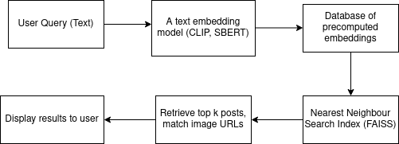

# CLIP-Powered Interactive Image Search

</img>

## Table of Contents

1.  [Project Overview](https://www.google.com/search?q=%231-project-overview)
2.  [Features and Workflows](https://www.google.com/search?q=%232-features-and-workflows)
3.  [Technical Architecture](https://www.google.com/search?q=%233-technical-architecture)
4.  [Data Collection and Preprocessing](https://www.google.com/search?q=%234-data-collection-and-preprocessing)
5.  [Model Details: Why OpenAI CLIP?](https://www.google.com/search?q=%235-model-details-why-openai-clip)
6.  [Getting Started](https://www.google.com/search?q=%236-getting-started)
7.  [Usage](https://www.google.com/search?q=%237-usage)
8.  [Dependencies](https://www.google.com/search?q=%238-dependencies)

-----

## 1\. Project Overview

This project is a Jupyter notebook that provides an interactive interface for searching images using a combination of text and visual queries. At its core, the system leverages OpenAI's powerful CLIP (Contrastive Language–Image Pre-training) model to enable a multimodal search experience. The notebook is designed to be user-friendly, with interactive widgets that allow users to input text queries, select search modes, and control the number of search results.

## 2\. Features and Workflows

The workflow is driven by interactive `ipywidgets` to create a seamless user experience.

### Main Workflow

1.  **Initialization:** Upon running the notebook, the necessary libraries, the CLIP model, and pre-computed image embeddings are loaded. This process is tracked by a progress bar.
2.  **User Interaction:** A user interface is displayed, featuring:
      * A text input field for the search query.
      * A dropdown menu to select the search type: "Smart Search (Combined)", "Text Only", or "Visual Only".
      * A slider to adjust the number of results to be displayed, ranging from 6 to 24.
      * A "🔍 Search" button to trigger the search based on the configured parameters.
      * A "🎲 Random" button to fetch a random set of images.
3.  **Search Execution:** When the "🔍 Search" button is clicked, the system processes the user's query according to the selected search type and retrieves the most relevant images from the pre-indexed dataset.
4.  **Result Display:** The selected images are displayed to the user.

### Workflow Choices and Their Significance

  * **Smart Search (Combined):** This is the primary and most powerful workflow. It combines both text-based and visual search methods to provide highly relevant results. This approach leverages the multimodal nature of the CLIP model, allowing for queries that are nuanced and context-aware.
  * **Text Only:** This workflow relies solely on the text query to find matching images. It's useful for a quick and direct search when you only have a text description.
  * **Visual Only:** This workflow allows users to search for similar images based on a visual input. This is valuable for finding images that are visually similar to a given example.

## 3\. Technical Architecture

The project's architecture is based on a few key components:

  * **Front-end (UI):** `ipywidgets` are used to build the interactive interface within the Jupyter notebook environment.
  * **Back-end (Logic):** The core logic is implemented in Python, handling user input, model inference, and result retrieval.
  * **Model:** OpenAI's CLIP model is the central component for encoding text and images into a shared embedding space.
  * **Data Storage:** A pre-computed vector database is used, stored in a NumPy array (`embeddings.npy`).

## 4\. Data Collection and Preprocessing

The notebook suggests that a large dataset of images has been collected and preprocessed before being used by the notebook.

  * **Data Collection:** The notebook's code does not show the data collection process itself. It loads image data from a pre-existing file named `images.txt`. This file appears to contain image data, potentially in a base64 encoded format, which is then decoded into images for processing.
  * **Data Preprocessing:**
    1.  **Image Decoding:** The images are first decoded from their base64 representation within the `images.txt` file.
    2.  **Image Transformation:** A critical preprocessing step is performed by the `preprocess` function provided by the CLIP library. This function automatically handles resizing, cropping, and normalization of images, ensuring they are in the correct format for the CLIP model.
  * **Indexing:** The embeddings for all images in the dataset have been pre-computed and stored in `embeddings.npy`. This pre-computation is a key architectural choice that drastically speeds up search queries. Instead of computing embeddings for every image at query time, the system can simply load them from disk and perform a similarity search.

## 5\. Model Details: Why OpenAI CLIP?

The project uses OpenAI's CLIP model for the following reasons:

  * **Multimodal Understanding:** CLIP is a powerful neural network trained on a massive dataset of (image, text) pairs. This training allows it to understand the relationship between text and images, making it ideal for both text-to-image and image-to-image search.
  * **Shared Embedding Space:** CLIP maps both text and images into a shared, high-dimensional vector space. This means a text query like "a dog" can be represented as a vector, and an image of a dog can be represented by a similar vector. The closer the vectors are in this space (measured by cosine similarity), the more relevant the image is to the text.
  * **Efficient Similarity Search:** By pre-computing the image embeddings and storing them in a NumPy array, the search process is reduced to a fast vector similarity calculation, rather than a computationally expensive real-time model inference on every image. This makes the search incredibly fast and efficient.

## 6\. Getting Started

1.  **Environment:** The project is best run in a Jupyter-compatible environment like Google Colab.
2.  **Upload:** Upload the `complete_nb.ipynb` notebook and the required data files (`embeddings.npy` and `images.txt`) to your environment.
3.  **Run:** Execute the cells in the notebook sequentially.

## 7\. Usage

Follow the workflow described in Section 2 to interact with the notebook and perform your searches.

## 8\. Dependencies

The notebook relies on the following Python libraries:

  * `torch`
  * `clip` (OpenAI)
  * `numpy`
  * `Pillow` (PIL)
  * `tqdm` (for progress bars)
  * `ipywidgets` and `IPython.display` (for the interactive interface)
  * `urllib`, `os`, `base64`, `io`, and `requests` (for data handling)

## Demo Output

## 9\. License

This project is intended for educational and professional use, with the license to be determined by the author.

-----
